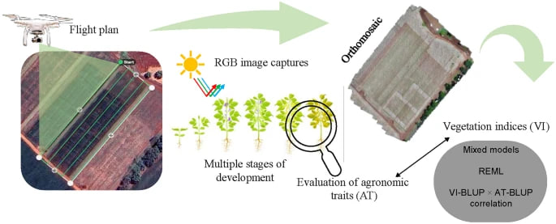
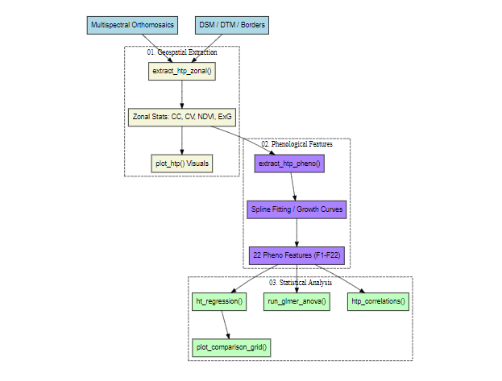
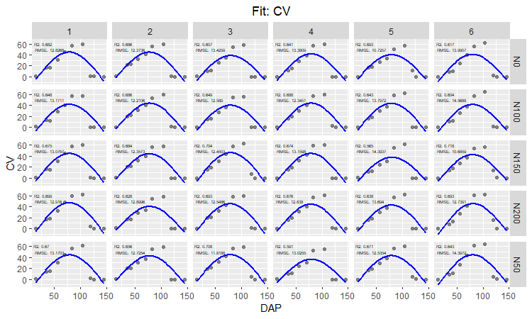
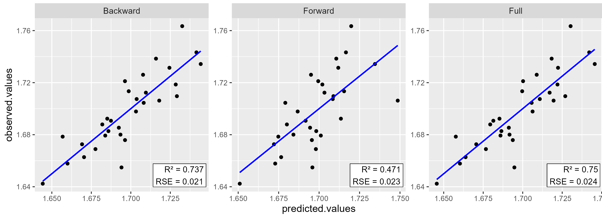

# *uavRpheno*: High-Throughput Phenotyping from UAV data


<p align="center">
<br>
<b>Figure 1.</b> Canopy Cover (CV) zonal data fitted with GAM with <code>plot_htp_fit</code> function.
</p>

[](https://www.repostatus.org/#active)  [-lightgrey.svg?style=flat)](http://www.gnu.org/licenses/gpl-2.0.html)

## 1. What is uavRpheno?

`uavRpheno` is a R library designed to perform common high-throughput phenotyping tasks using time series of multispectral imagery in the context of agronomic experimental trials. The toolkit enables the fast and simple derivation of vegetation indices and structural canopy variables from UAV imagery.

The package focuses on extracting multispectral indicators such as canopy cover, canopy volume, excessive greenness index, and normalized difference vegetation index. In addition, it provides tools for modeling crop phenology using spline-based growth curves and for conducting statistical analysis through regression and generalized linear mixed models. Several plotting utilities are also included to visualize spatial variables, phenological curves, and statistical relationships.

---


<!--  -->

<p align="center">
<br>
<b>Figure 2.</b> Workflow of the <code>uavRpheno</code> processing pipeline.
</p>


## 2. Problem Statement

Phenotyping is the process of measuring and analyzing observable plant traits in order to understand their characteristics, performance, and genetic makeup (Bian et al., 2022). In modern agricultural research, remote sensing technologies such as UAV platforms and satellite imagery have become important tools for collecting phenotypic information at high spatial and temporal resolution (Roth & Streit,2018).


Typical phenotyping workflows consist of repeated multispectral UAV surveys during the crop growing season. From these observations, vegetation indices and canopy structural metrics can be derived to characterize plant health and development. By analyzing time-series observations of these variables, it becomes possible to model crop growth dynamics and extract phenological parameters (Borra-Serrano et al.,2020).

Because high-throughput phenotyping is often applied in agricultural experimental trials, the unit of analysis should consider not only the genotype or variety under study but also the experimental block or replication structure of the design.

Despite the growing availability of remote sensing data, there are still relatively few simple workflows that allow researchers to easily derive phenotypic parameters from multispectral imagery and integrate them with agronomic traits such as yield or productivity indicators. `uavRpheno` aims to provide a practical workflow for extracting phenotypic variables, modeling crop growth, and linking these features with traits of agronomic interest.

---
## 🛠 Installation
 
Follow these steps to set up **uavRpheno**  in your environment:

### 1. Install Dependencies
First, ensure you have the `remotes` package installed from CRAN:

```r
install.packages("remotes")
```

### 2. Install uavRpheno
Run the following command to install the package directly from the repository:

```r
remotes::install_github("kundun14/uavRpheno")
```

### 3. Load the Library
Once the installation is complete, load the package:

```r
library(uavRpheno)
```

# Modeling Workflow

## 3. Zonal Extraction of HTP Variables

### `extract_htp_zonal()`

This function processes multispectral reflectance data and digital surface models (DSM) for each flight time and produces a set of geospatial products to sucesive analysis. 
Canopy cover (CC), canopy volume (CV), excessive greenness index (ExG), and normalized difference vegetation index (NDVI) can be generated from RGB and multispectral orthomosaic images together with digital surface models (DSM) (Chang et al, 2021).

The following equations are used to derive canopy cover and vegetation indices from RGB and multispectral imagery (Patrignani et al.,2015).

#### Canopy detection rule

$$
\text{Canopy} =
\left(\frac{\text{Red}}{\text{Green}} < P_1 \right)
\;\land\;
\left(\frac{\text{Blue}}{\text{Green}} < P_2 \right)
\;\land\;
\left(2 \cdot \text{Green} - \text{Red} - \text{Blue} > P_3 \right)
$$

#### Excess Green Index (ExG)

$$
ExG = 2g - r - b
$$

where the normalized RGB components are defined as

$$
r = \frac{\text{Red}}{\text{Red} + \text{Green} + \text{Blue}}
$$

$$
g = \frac{\text{Green}}{\text{Red} + \text{Green} + \text{Blue}}
$$

$$
b = \frac{\text{Blue}}{\text{Red} + \text{Green} + \text{Blue}}
$$

#### Normalized Difference Vegetation Index (NDVI)

$$
NDVI = \frac{\text{NIR} - \text{Red}}{\text{NIR} + \text{Red}}
$$


We can generate the zonal statistics of the geospatial products, also write the
correspoding files in the local folder.

```r
htp_zonal <- extract_htp_zonal(
  multi_path = 'PROCESING/multi/',
  dsm_path = 'PROCESING/dsm/',
  border_path = 'PROCESING/borders/trail_trigo.gpkg',
  dtm_file = 'PROCESING/dtm/dtm_14.tif',
  save_rasters = FALSE,
  treatment_var = "treatment",
  blocking_var = "blocking",
  daps = c("14", "35", "42", "56", "70","83","104","119","126","145"),
  band_indices = c(B = 1, G = 2, R = 3, RE = 4, NIR = 5, T = 6)
)
```

---

The geospatial products genereted can be ploted  across the full or partial crop growth period. The example below generates plots for treatment **N50** and block **1** for the first four observation dates (DAP).

```r
plot_htp(
  output_path = "OUTPUT/",
  multi_path = "PROCESING/multi/",
  treatment = "N50",
  blocking = "1",
  border_file = 'PROCESING/borders/trail_trigo.gpkg',
  daps =  c("14","35","42","56"),
  plot_path = "OUTPUT/PLOTS/")

```

<p align="center">
<br>
<b>Figure 3.</b> RGB, CC, CV, NDVI and ExG image time series ploted by treatment and repetition. All masked by the green pixel detection formula.
</p>


---

## 4. Phenological Feature Extraction

### `extract_htp_pheno()`

This function allows to derive phenotypic features extracted from the zonal statistics of the geospatial products fitted with generalized additive model (GAM) functions using [`mgcv`](https://cran.r-project.org/web/packages/mgcv/index.html) library.

Maximum canopy cover and canopy volume values can be obtained. Growth-rate curves are then used to derive additional parameters such as maximum growth rate, the day after planting at which this maximum occurs, and the duration of the half-maximum growth period.

Additional phenological metrics are derived from ExG and NDVI fitted curves  curves. For the ExG curve, slopes representing canopy expansion and senescence are obtained by fitting linear models to the increasing and decreasing canopy phases. Metrics such as maximum values, duration, and area under each phase of the curve are then calculated. Similarly, NDVI progression curves provide features including maximum NDVI, the DAP at which this maximum occurs, and the slopes representing vegetation increase and decline throughout the crop cycle.

The full list of features are shox in the following table:

| Features Name | Feature Description |
| :--- | :--- |
| F1 | Maximum value of CC |
| F2 | Maximum growth rate of CC |
| F3 | DAP at maximum growth rate of CC |
| F4 | Duration over the half maximum period of CC |
| F5 | Maximum value of CV |
| F6 | Maximum growth rate of CV |
| F7 | DAP at maximum growth rate of CV |
| F8 | Duration over the half maximum period of CV |
| F9 | Maximum of ExG value |
| F10 | DAP at maximum of ExG value |
| F11 | Increasing slope of ExG |
| F12 | Maximum value of increasing line at maximum ExG DAP |
| F13 | Duration of increasing ExG period |
| F14 | Area of increasing period of ExG |
| F15 | Decreasing slope of ExG |
| F16 | Maximum value of decreasing line at maximum ExG DAP |
| F17 | Duration of decreasing ExG period |
| F18 | Area of decreasing period of ExG |
| F19 | Maximum NDVI value |
| F20 | DAP at maximum NDVI value |
| F21 | Increasing slope of NDVI |
| F22 | Decreasing slope of NDVI |


```r

htp_features <- extract_htp_pheno(
  data = test_zonal,
  indices = c("CC", "CV", "ExG", "NDVI"),
  time_var = "DAP",
  k = 3
)

```

The function also returns fitting quality metrics such as **R²** and **RMSE** for each block of the experimental design.

<!-- ```r
htp_features <- htp_pheno$features
htp_fitting_metrics <- htp_pheno$quality
``` -->

We can plot the fitted functions for each genotype or treatment and each variable with <code>plot_htp_fit</code> function, here we show the fitte functions for Canopy Cover (CV).

<p align="center">
<br>
<b>Figure 4.</b> Canopy Cover (CV) zonal data fitted with GAM with <code>plot_htp_fit</code> function.
</p>


---

# Statistical Modeling

## 5. Trait Dataset

Users can import agronomic traits from an external spreadsheet structured by genotype and block. For demonstration, the library provides a sample dataset from a wheat yield experiment in Peru.

```r
traits <-  data("traits_trigo")
```

---

## 6. Correlation Analysis

### `htp_correlations()`

This function generates correlation tables between the extracted phenological features and a selected agronomic trait.

Example:

```r
cor_table <- htp_correlations(traits = traits_trigo,
                              htp_features = htp_features,
                              trait = "yield_kg_plot")

```

---

## 7. ANOVA

### `run_glmer_anova()`

Genetic differences among genotypes can be evaluated using analysis of variance based on generalized linear mixed models via the <code>lme4::lmer </code> function of [`lme4`](https://cran.r-project.org/web/packages/lme4/index.html) library .

Agronomic trials typically follow a randomized complete block design (RCBD). In this framework, the blocks are treated as random effects within a generalized linear mixed model with Gaussian error distribution and identity link function.

Example:

```r
anova_results <- run_glmer_anova(traits = traits_trigo,
                                 htp_features = htp_features,
                                 trait = 'yield_kg_plot')

```

---

## 8. Regression Modeling

### `ht_regression()`

This function develops predictive models using the set of twenty-two phenotypic features. Two automatic feature-selection strategies are implemented.

The first strategy applies forward feature selection, starting from a null model and progressively adding predictors. The second strategy applies backward feature elimination, beginning with a full model and removing non-significant variables.

Example:

```r
reg_results <- htp_regression(traits = traits_trigo,
                              htp_features = htp_features,
                              trait = "yield_kg_plot")
```

Model comparisons and diagnostic plots can be generated with: 

```r
plot_comparison_grid(
  reg_results,
  plot_path = "PROCESING/PLOTS/REGRES/"
)
``` 

<!-- # Generated figures:

# <!-- ```
# fig / regresion_plots.png
# ``` -->
<!-- #  --> 

<p align="center">
<br>
<b>Figure 5.</b> Results regression of yield vs phenological features derived with uavRpheno.
</p>


## Current status

Ploting functions are currently under deveploment. 

## References

* **Bian, C., Shi, H., Wu, S., Zhang, K., Wei, M., Zhao, Y., ... & Chen, S. (2022).** Prediction of Field-Scale Wheat Yield Using Machine Learning Method and Multi-Spectral UAV Data. *Remote Sensing*, 14(6), 1474. https://doi.org/10.3390/rs14061474
* **Borra-Serrano, I., De Swaef, T., Quataert, P., Aper, J., Saleem, A., Saeys, W., ... & Lootens, P. (2020).** Closing the Phenotyping Gap: High Resolution UAV Time Series for Soybean Growth Analysis Provides Objective Data from Field Trials. *Remote Sensing*, 12(10), 1644. https://doi.org/10.3390/rs12101644
* **Chang, A., Jung, J., Yeom, J., Maeda, M. M., Landivar, J. A., Enciso, J. M., ... & Anciso, J. R. (2021).** Unmanned Aircraft System-(UAS-) Based High-Throughput Phenotyping (HTP) for Tomato Yield Estimation. *Journal of Sensors*, 2021(1), 8875606. https://doi.org/10.1155/2021/8875606
* **Patrignani, A., & Ochsner, T. E. (2015).** Canopeo: A Powerful New Tool for Measuring Fractional Green Canopy Cover. *Agronomy Journal*, 107(6), 2312-2320. https://doi.org/10.2134/agronj15.0150
* **Roth, L., & Streit, B. (2018).** Predicting Cover Crop Biomass by Lightweight UAS-Based RGB and NIR Photography: An Applied Photogrammetric Approach. *Precision Agriculture*, 19(1), 93-114. https://doi.org/10.1007/s11119-017-9501-1
